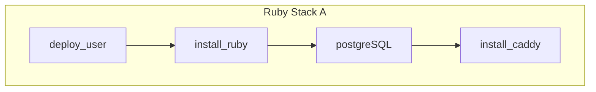
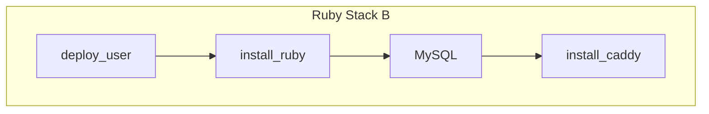
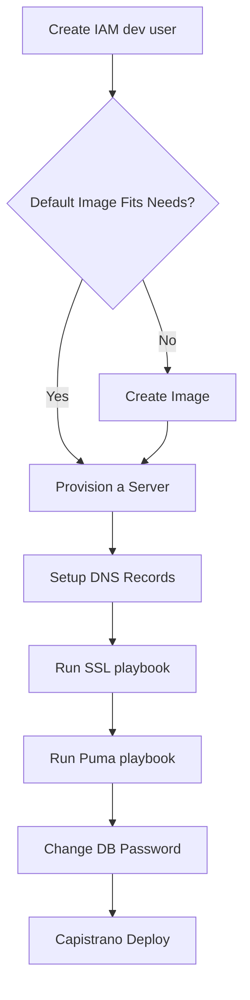

# HiveGrid

HiveGrid is a toolchain that simplifies the deployment of Rails 7 applications on AWS by automating the provisioning and configuration of EC2 instances.

Read about the [background](https://www.hivegrid.dev/about/) to learn why this project exists or the entertaining [background story](./sweat.md).

## Purpose

Automate the software delivery process by using a toolchain that leverages Packer, Terraform, Ansible and cloud provider SDKs. The toolchain simplifies infrastructure management tasks by using a declarative language, pre-built templates for common use cases and glue code to integrate with cloud providers.

It targets developers at companies with limited or no DevOps resources. It reduces the time spent on manual infrastructure tasks from days to minutes. Developers can focus more on application development rather than infrastructure complexities. It is designed for those comfortable with the command-line interface, offering customizable templates for each phase of software delivery to streamline processes and enhance efficiency in the software delivery workflow.

## Who is it for?

HiveGrid is tailored for early-stage startups that are still searching for product/market fit. Scalability is not the immediate concern and modular solution allows startups to iterate quickly based on market feedback.

With this lightweight toochain, you can rapidly build, deploy and experiment with features without the burden of complex architectures. You can validate ideas, make data-driven decisions and adapt your product as you learn more about your target market.

By leveraging the modular approach, you can start small, gradually evolve and prioritize features that resonate with users. Whether you're a small team or a solo founder, HiveGrid is designed to keep your development process lean, agile and focused on rapid experimentation and learning about your target market.

## Modular Toolchain

HiveGrid differs from the competition by offering a modular design that prioritizes simplicity and flexibility. A set of reusable building blocks can be choosen and you can use only what you need for your specific use case. This avoids bloat and keeps your system lean and efficient.

It does not impose opinionated choices or predefined architectures. You have the freedom to select the components that fits your requirements. You can avoid over-engineering and unnecessary complexity, especially in the early stages of your startup.

With our modular design, you can start with a simple architecture that meets your immediate needs and gradually evolve your architecture organically as your business grows.

You don't need to start with a complex architecture. Complex systems have steep learning curves and can be overwhelming. Beginning with a simpler architecture makes it easier to learn and adapt over time.

The building blocks are designed to be flexible and adaptable, allowing you to build a new system from scratch. The modular components can be combined and customized to create a solution tailored to your needs.

Choose simplicity, flexibility and modularity and stay focused on what matters most — building a successful product.





## Project Scope

| Task              | Description                                                                                                 | Tools            |
| ----------------- | ----------------------------------------------------------------------------------------------------------- | ---------------- |
| Install           | Install the software binaries and all dependencies                                                          | Ansible, Packer  |
| Configure         | Configure the software at runtime. TLS certs, firewall settings etc                                         | Ansible          |
| Provision         | Provision the infrastructure. Includes servers, network configuration, IAM permissions                      | Terraform        |


These tools have clear separation of responsibilities, making it easier to extend and customize the functionality according to our needs.

## Choice of Tools

We've knitted together Ansible, Packer, and Terraform to whip up servers on AWS like it's nobody's business. Ansible cuts through the configuration chaos, letting us cherry-pick cloud services, slap on software, and select our web framework with a declarative flair. Packer is our Swiss Army knife, slicing across cloud platforms to provision servers without breaking a sweat. And Terraform? It’s the smart cookie that keeps our code lean and mean, thanks to its idempotent magic. Meshing these tools together, we've streamlined our AWS server setup, keeping our workflow slick, adaptable, and blazing fast.

To learn more, read [Toolchain](https://hivegrid.dev/articles/toolchain)

### Advantages of the Toolchain

- Ensures consistent, reliable and reproducible environments
- Automates processes, saving time and reducing human errors
- Enables easy scalability, configuration, and cross-environment deployment
- Facilitates version control, collaboration and rollbacks

## Packer Image


* **Base Image:**  This is your starting point. It is a generic operating system image (e.g., Ubuntu, CentOS).
* **Packer:** This is the tool that automates the process of image creation. You define the desired configuration of your custom image in a Packer template.
* **Ansible:** Packer uses Ansible as a provisioner to configure and customize the base image.
* **Custom Image:** This is the final product produced by Packer. It includes all the modifications you specified, such as:
    * Installed software packages
    * System configurations

## Rails Stack

The custom AMI created by Packer provides:

| Name         | Version                                                                                  |
| ------------ | ---------------------------------------------------------------------------------------- |
| Ruby         | 3.3.0                                                                                    |
| RubyGem      | 2.3.6                                                                                    |
| Caddy        | 2.7.6                                                                                    |
| PostgreSQL   | psql (PostgreSQL) 16.2 (Ubuntu 16.2-1.pgdg22.04+1)                                       |
| Redis        | Redis server v=7.2.4 sha=00000000:0 malloc=jemalloc-5.3.0 bits=64 build=4a33ab3ec422ece7 |
| Git          | git version 2.34.1                                                                       |
| Goss         | 0.4.4                                                                                    |

See [versions](./VERSIONS.md) for more details.

### Customized Image

If the image created by Packer does not meet your requirements, you can:

1. Customize the Packer template:
   - Open the file `packer/aws-ubuntu.pkr.hcl`
   - Modify the base image and other configurations as needed

2. Modify the master playbook:
   - Open the file `ansible/playbooks/master_playbook.yml`
   - Change the included playbooks to suit your needs
     - For example, you can create a new playbook for MySQL and replace the Postgres playbook

3. Customize versions in existing playbooks:
   - Go to the `ansible/playbooks` folder
   - Modify the versions for Ruby, Postgresql, Redis, etc. in the corresponding playbooks

By following these steps, you can tailor the Packer-generated image to your specific requirements.

## Terraform Provisioning

The custom image created in the previous step is the input to Terraform and the output is a running EC2 instance:


1. The custom image, which was created using Packer and Ansible, serves as an input to Terraform.
2. Terraform, as an infrastructure as code (IaC) tool, uses the custom image to define and provision the desired infrastructure.
3. Terraform creates an EC2 instance based on the specifications defined in the Terraform configuration files.
4. The EC2 instance is launched using the custom image, ensuring that it includes all the necessary software, configurations, and customizations.

This diagram illustrates the workflow where the custom image, created through the Packer and Ansible, is consumed by Terraform to provision an EC2 instance. Terraform allows you to define the desired state of your infrastructure using declarative configuration files, and it automatically provisions and manages the EC2 instance based on that configuration.

By using a custom image for the EC2 instance, we ensure that the instance is pre-configured with the required software and settings, reducing manual setup and configuration after the instance is launched.

The Terraform template defines the following configuration:

- Instance Type: t2.medium
- Region: us-west-2

See [main.tf](./terraform/main.tf) for more details. You can change it in terraform/variables.tf.

## Getting Started

### Prerequisites

An AWS account
[](https://www.youtube.com/watch?v=qSq6f6fZ_bs)
- An IAM user with appropriate policies for EC2, S3, and AWS Secrets Manager
- Packer and Terraform installed and configured

SSH Access:

The PEM file used for SSH access to your EC2 instance, is stored in AWS Secrets Manager. This means you can retrieve the PEM file even if you lose the original downloaded copy. You will be charged for storing the PEM file in Secrets Manager. To avoid the cost, you can delete the PEM file from the AWS console after downloading it.

Database Backups:
AWS S3 is used for storing database backups.

### Download PEM File

You must have nodejs installed on your laptop. To install dependencies, go to javascript folder directory and run:

```
npm install
```

Set the following environment variables to proper values:

```bash
AWS_ACCESS_KEY_ID
AWS_SECRET_ACCESS_KEY
ROR_SECRET_KEY
```

You will see the value for `ROR_SECRET_KEY` from the output of the `terraform apply` command.

To download the PEM file, run:

```bash
node keyDownload.js
```

### Steps

Clone this project. 

```bash
git clone git@github.com:bparanj/hivegrid.dev.git
```

From the root of the project, run the Terraform template:

```bash
terraform apply terraform/main.tf
```

## Where to Get Help

Join the [discussions](https://github.com/bparanj/hivegrid.dev/discussions) to get help.

## Ansible Playbooks

Packer uses Ansible as the provisioner. The Ansible playbooks are included in the master playbook. Packer runs the master playbook to create a custom AMI from a base Ubuntu 22.04 image. The playbooks:

- Install required packages on Ubuntu 22.04
- Install and configure Fail2ban
- Setup deploy user
- Harden SSH Configuration
- Install and Configure Caddy Server
- Install Ruby 3.3.0
- Install PostgreSQL 16
- Install and Setup Redis
- Set server timezone to UTC

See [playbooks](./PLAYBOOKS.md) for more details.

## Deploying Rails App

You can use Capistrano to deploy your Rails 7.1 app to the provisioned server. We will be using dotenv gem to manage environment variables on the production server.


The EC2 instance, provisioned using Terraform with a custom image, serves as the target environment for the deployed application. Capistrano is used minimally,  mainly because the DSL has a learning curve. If a task can be done in Ansible, it is preferred over Capistrano.

## Testing

The image is tested using Goss. The tests folder contains the tests. Test results are exposed as a JSON endpoint. It can be accessed only within the EC2 instance. SSH into your EC2 instance and run:

```bash
curl http://localhost:8080/healthz | jq .
```

### Goss Test Setup

For adding tests:

- Review the Packer and Terraform template
- Manually `run goss autoadd` on the server
- Copy the generated file on the server to tests/goss.yaml file in the project

## Image Catalog and Provisioning Template

Each stack has its own image and provisioning template, illustrating the separation between the different stacks.


## Contributing

Join the [discussions](https://github.com/bparanj/hivegrid.dev/discussions) to start contributing to this project. Ways to contribute:

- Ansible playbooks for other SQL and NoSQL database servers
- Support other Linux flavors like RHEL, Debian etc.
- Packer and Terraform template for other cloud providers like:

| #    | Provider        |
|------|-----------------|
| 1    | Microsoft Azure |
| 2    | Google Cloud    |
| 3    | Digital Ocean   |
| 4    | Linode          |

- Add support for other full stack MVC frameworks like: 

| #    | Framework        | Language     | 
|------|------------------|--------------|
| 1    | Django           | Python       |
| 2    | Laravel          | PHP          |
| 3    | ASP.NET Core MVC | C#           |
| 4    | Spring Boot      | Java         |
| 5    | Phoenix          | Elixir       |
| 6    | Play Framework   | Java/Scala   |

## License

HiveGrid is released under the [MIT License](https://opensource.org/licenses/MIT).

## Hooks

You can customize the process in any of the following phases:

1. Base Image
2. Your Custom Hook
3. Custom Image - Packer Build
4. Your Custom Hook
5. Provision Instance - Terraform Provision
6. Your Custom Hook
7. Capistrano Deploy

Your custom hooks can be cloud-init, code written using Ruby, Python, Java or any other SDK for AWS.

## Getting Started Guide

### Create a AWS Account

[](https://www.youtube.com/watch?v=qSq6f6fZ_bs)

More videos to walk you through each step is coming soon.

## Process at a High Level



Create Image step is optional. It is only required if the default image does not fit your needs.

## Request Flow


## Alternatives

There are alternatives like [Zero](https://github.com/commitdev/zero)
